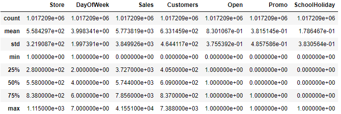
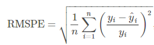

# Machine Learning Engineer Nanodegree
## Capstone Proposal
Yiran Tian
April 23th, 2020

## Proposal

### Domain Background
Machine learning technology are widely used for data engineering to solve problem in many industry field, such as financial, medical weather forecast, etc. Many have already impact our daily life.

Rossmann operates over 3,000 drug stores in 7 European countries. Store sales are critical for such cross region existance. Store sales are influenced by many factors, including promotions, competition, school and state holidays, seasonality, and locality. With thousands of individual managers predicting sales based on their unique circumstances, the accuracy of results can be quite varied.

### Problem Statement
Currently, Rossmann store managers are tasked with predicting their daily sales for up to six weeks in advance. More percisly, the target outputs are sales prediction for each day, and can up to six weeks long. As state before, this sales can be influenced by many factor, and those data can work together, to help identify the future sales figure.

To solve this issue, a machine learning model will be build to fullfil this tasks. Candidate model including general supervised lerning model such as SGD Regressor, Lasso, EnsembleRegressors, XGBoost, as well as MLP. Decision will be made after exploring and engineering of data.

### Datasets and Inputs
There are three critical files for the data inputs. Which are:
- train.csv: historical data including Sales
- test.csv: historical data excluding Sales
- sample_submission.csv: a sample submission file in the correct format
- store.csv: supplemental information about the stores

For train.csv and test.csv, they all contains following data fields:
- Id: an Id that represents a (Store, Date) duple within the test set
- Store: a unique Id for each store
- Sales: the turnover for any given day (this is what you are predicting)
- Customers: the number of customers on a given day
- Open: an indicator for whether the store was open: 0 = closed, 1 = open
- StateHoliday: indicates a state holiday. Normally all stores, with few exceptions, are closed on state holidays. Note that all schools are closed on public holidays and weekends. a = public holiday, b = Easter holiday, c = Christmas, 0 = None
- SchoolHoliday: indicates if the (Store, Date) was affected by the closure of public schools
- StoreType: differentiates between 4 different store models: a, b, c, d
- Assortment: describes an assortment level: a = basic, b = extra, c = extended
- CompetitionDistance: distance in meters to the nearest competitor store
- CompetitionOpenSince[Month/Year]: gives the approximate year and month of the time the nearest competitor was opened
- Promo: indicates whether a store is running a promo on that day
- Promo2: Promo2 is a continuing and consecutive promotion for some stores: 0 = store is not participating, 1 = store is participating
- Promo2Since[Year/Week]: describes the year and calendar week when the store started participating in Promo2
- PromoInterval: describes the consecutive intervals Promo2 is started, naming the months the promotion is started anew. E.g. "Feb,May,Aug,Nov" means each round starts in February, May, August, November of any given year for that store

Generally, there are 1115 stores in total. The data provided including 1017209 log, covering more than 3 years of data. The train.csv data description shown as below:

### Solution Statement
The solution will be first analyze the data, cleanning data with appropriate method and deicde a good way to engineering it. Then normalize the data if neccassary. Data if further divided in to training and validation sets for next step training. After training, the result is submit to kaggle.

As the model is not decided yet, but highly likely to be XGBoost or RNN model. More detail is not provided yet. However, a hyper-parameters tuning process is planned to have better result of final testing.

### Benchmark Model
Cross validation will be adopted to avoid over-fitting. KFold will be introduce to make most use of data. Learning curve technique will also used to avoid complex model. As the final evaluation metrics used is RMSPE, during benchmarking, same benchmark metrics will be used to decide the performance of each model configuration.

As this task is also a Kaggle competition, a leaderboard position is preferred. However, I decided not to use leaderboard position as a benchmark result. This is because I want to better explorer model usage, instead of find a best model and copy what's already on the board.

### Evaluation Metrics
Submissions are evaluated on the Root Mean Square Percentage Error (RMSPE). The RMSPE is calculated as

where y_i denotes the sales of a single store on a single day and y^i denotes the corresponding prediction. Any day and store with 0 sales is ignored in scoring.

Compared with general Root Mean Square Error, RMSPE further taking into account the divergence compare with the original real value. By doing so, the RMSPE value is meaningful and descript the error relationship with the correct label.

### Project Design
The project will be divided into following sections.
#### Features Study
In this section, input data sets will be analyzed to understand all the data in depth. Data engineering approach is also analyze and decide during this section.

#### Data Engineering
Input data will be cleaned, engineered, normalized for further development. Also, training and validation data set will be divided.

#### Model Design
Model will be create and fit. Hyper-parameters tuning will also involved to generate best outcomes. Multiple evaluation techniques will also introduced to ensure a good result.

#### Predict for Test and Submission File Generating
Final result is generated here and submission file is also created. 

### Reference
[Kaggle competition: Rossmann Store Sales](https://www.kaggle.com/c/rossmann-store-sales/overview)
[Understanding LSTM Networks](https://colah.github.io/posts/2015-08-Understanding-LSTMs/)
[Time Series Prediction using LSTM with PyTorch in Python](https://stackabuse.com/time-series-prediction-using-lstm-with-pytorch-in-python/)